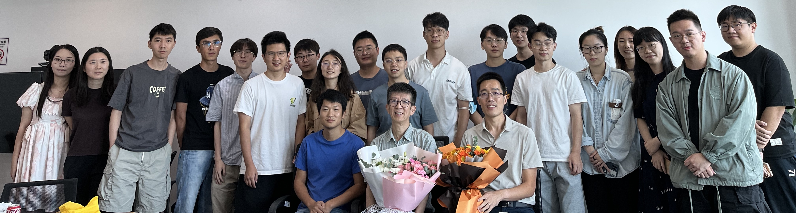
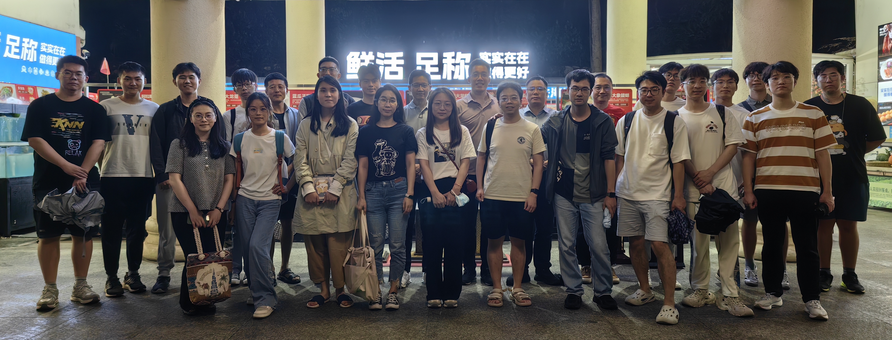

<!-- # Team Profile -->

My team is broadly interested in audio and speech processing, multi-modality, DeepFake detection, natural language processing. We publish our work in the top conferences and journals, and deploy research output to products by collaborating with industry. My team has open positions for postdocs, PhD students, research assistants, and visiting research students/researchers. If you are interested in my team, feel free to contact me.

## Team members

### Post-docs

- [Liumeng Xue](https://scholar.google.com/citations?user=KNqxVT0AAAAJ&hl=en) (Ex-Microsoft, Ex-JD, PhD from Northwestern Polytechnical University)

### PhD & MPhil students

- [Xueyao Zhang](https://www.zhangxueyao.com/) (2022 Fall) 入选“腾讯犀牛鸟精英人才计划”
- [Li Wang](https://wwwwwli.github.io/) (2023 Fall) 
- [Yuancheng Wang](https://arxiv.org/abs/2304.00830) (2023 Fall)
- [Jiaqi Li] (2024 Fall) UG from CUHK-Shenzhen, Intern@Microsoft Research
- [Junan Zhang] (2024 Fall) UG from Fudan University
- [Zihao Fang] (2024 Fall MPhil) UG from CUHK-Shenzhen

### RAs and interns

- Li Wang (Full-time RA at CUHK-Shenzhen)
- Haorui He (Full-time RA at CUHK-Shenzhen)
- Xiaoyan Lei (Full-time RA at CUHK-Shenzhen)
- Liwei Liu (Full-time RA at CUHK-Shenzhen)
- Yukun Li (Visiting PhD student from London Queen Mary University)
- Haotian Guo (Visiting MEng student from Hunan University)
- Peizhuo Liu (Visiting MEng student from NorthernEast University)
- Junan Zhang (Intern@Shanghai AI Lab from Fudan University)
- Zeyu Xie (Intern@Shanghai AI Lab from Shanghai Jiaotong University)

### Undergraduates and Master students
- Jiakun Pei (Master of Data Science: CUHK-Shenzhen)
- Yuhao Luo (Master of Data Science: CUHK-Shenzhen)
- Yicheng Gu (Undergraduate: CUHK-Shenzhen)
- Chaoren Wang (Undergraduate: CUHK-Shenzhen)
- Jiaqi Li (Undergraduate: CUHK-Shenzhen)
- Jiahao Zheng (Undergraduate: CUHK-Shenzhen)
- Tze Ying Tang (Undergraduate: CUHK-Shenzhen)
- Haopeng Chen (URA)
- Zihao Fang (URA)

## Students I have worked with

- Yang Gao (2020 - 2022: Thesis committee, PhD from Carnegie Mellon University. First job: Amazon, United States)
- Shehzeen Hussain (Summer 2020: Intern at Meta. PhD student at University of California, San Diego)
- Lifa Sun (Summer 2017: Intern at Apple. PhD from the Chinese University of Hong Kong. First job: co-founder of SpeechX)
- Xiaohai Tian (2013 - 2017: Co-advisor, PhD from NTU. First job: Bytedance Singapore)
- Thomas Merritt (2015 - 2016: PhD from University of Edinburgh. First job: Amazon, United Kingdom)
- Srikanth Ronanki (2015 - 2016: PhD from University of Edinburgh. First job: Amazon, United Kingdom)
- Qiong Hu (2015 - 2016: PhD from University of Edinburgh. First job: Apple, United States)
